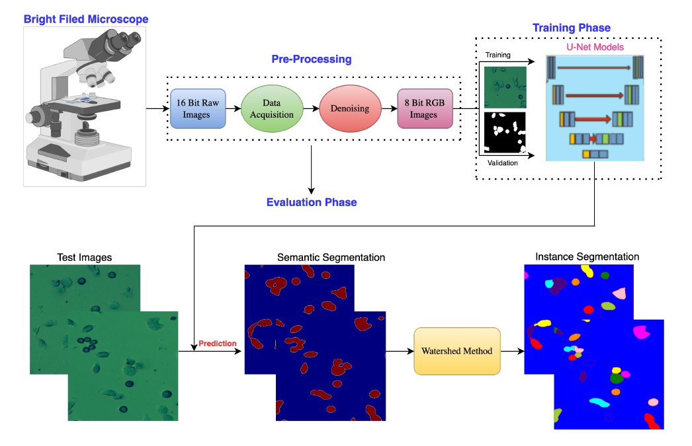
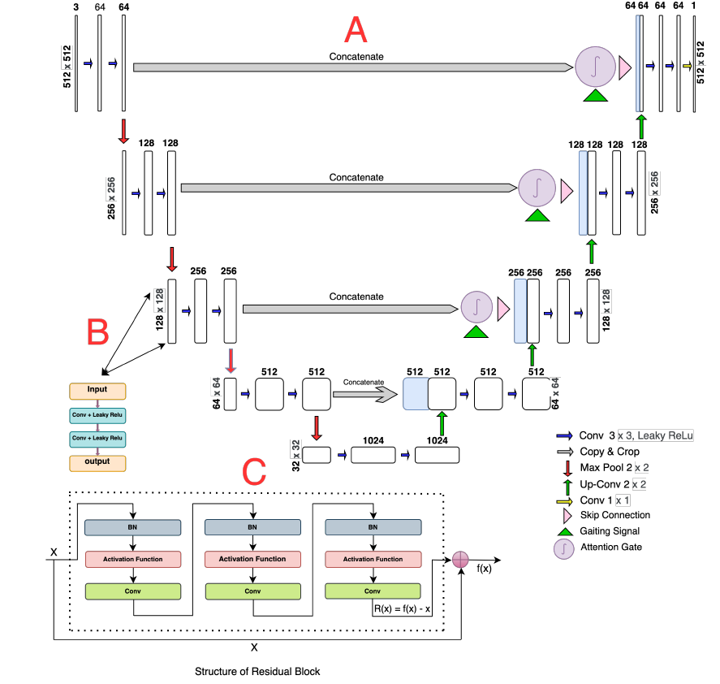

# Different U-Net - Neural Networks architecture for Semantic Segmentation from bright field microscopic time-series images


This is the official repository of **Different U-Net - Neural Networks architecture for Semantic Segmentation from bright field microscopic time-series images** 


**Compression between Different U-Net - Neural Networks architecture for Semantic Segmentation** <br />

[Ali Ghaznavi<sup>∗</sup>](http://web.frov.jcu.cz/cs/o-fakulte/soucasti-fakulty/ustav-komplexnich-systemu-uks/labo-exp-komplex-systemu), 
[Renata Rycht´arikov´<sup>∗</sup>](http://web.frov.jcu.cz/cs/o-fakulte/soucasti-fakulty/ustav-komplexnich-systemu-uks/labo-exp-komplex-systemu), 
[Mohammadmehdi Saberioon](https://www.gfz-potsdam.de/staff/mohammadmehdi.saberioon/sec14),
[Dalibor ˇStys<sup>∗</sup>](http://web.frov.jcu.cz/cs/kontakty-frov-ju/181-prof-rndr-dalibor-stys-csc) <br />
(* *indicates equal contribution*)

**For details, please refer to:**

**[[Paper](https://www.researchgate.net/publication/359437115_Cell_segmentation_from_telecentric_brightfield_transmitted_light_microscopic_images_using_a_Residual_Attention_U-Net_a_case_study_on_HeLa_line)]** 


## Abstract

A case study on HeLa line. Living cell segmentation from bright-field light microscopic images is challenging due to the image complexity and temporal changes in the living cells. Recently developed deep learning (DL)-based methods became popular in medical and microscopic image segmentation tasks due to their success and promising outcomes. The main objective of this paper is to develop a deep learning, UNet-based method to segment the living cells of the HeLa line in bright-field transmitted light microscopy. To find the most suitable architecture for our datasets, we have proposed a residual attention U-Net and compared it with an attention and a simple U-Net architecture. The attention mechanism highlights the remarkable features and suppresses activations in the irrelevant image regions. The residual mechanism overcomes with vanishing gradient problem. The Mean-IoU score for our datasets reaches 0.9505, 0.9524, and 0.9530 for the simple, attention, and residual attention U-Net, respectively. We achieved the most accurate semantic segmentation results in the Mean-IoU and Dice metrics by applying the residual and attention mechanisms together. The watershed method applied to this best - Residual Attention - semantic segmentation result gave the segmentation with the specific information for each cell.

## Introduction

##### Cell segmentation from telecentric bright-field transmitted light microscopic images using a Residual Attention U-Net:

###### A case study on HeLa line

The data  achieved by transmitted light microscope from living Hela cells in different time-laps experiments under the condition already have been described in manuscript and divided to train, test and validation sets.

The labeled data have been prepared manually to train with the deep learning based methods

The models have been trained based on three different U-Net architecture (with the size of 512 * 512) to achieve the best segmentation result already reported in manuscript.


## (1) Dataset and pre-trained model

**The Data-Set is Available in below links:**

[To download Dataset you can use this link:]:  [click here](https://jucb-my.sharepoint.comPre/:f:/g/personal/ghaznavi_jcu_cz/EnCjuDqA5ixFmhXUn4G2JykBri7f0cUn1yDG4hjJ8JyXpQ?e=wCjTzq)	"Microscopic data-set web directory include: Training, Testing and Validation datasets are separately available in the linked repository."

[To download Pre-Trained Models you can use this link:]: [click here](https://jucb-my.sharepoint.com/:f:/g/personal/ghaznavi_jcu_cz/Etu-CJIqxbdPs_nmsCqRw4ABq6vru9xUyPM-4lGJSEnVQ?e=bX7A3m)	"Pre-trained web directory include:  Pre-trained model available in the linked repository."


## (2) Methodology and DNN Architectures

We use this Deep Neural Network architecture:
Modelling Bright Filed Dataset on U-Net Networks:


<p align="center">  </p>


**Important hyperparameters setup:**

 Image Size  = 512 * 512

 number of layer ; default = 5

 Activation function = Leaky ReLU

 epoch size; default = 100

 batch size; default = 8

 Early Stop = 15

 learning rate ; default = 10e -3

 Step per Epoch = 100

 dropout_rate = 0.05


<p align="center">  </p>

## (3) Usage

**To run the script please use this file on Google Colab or Jupyter Notebook:**

```python
U_Net_ATT_Unet+Res_Unet_Pub_V2.ipynb
```


## (4) Evaluation and metrics

**We uses evaluation Metrics for experimental results:**

Precision, Recall, Intersection over Union (IoU), Accuracy, Dice 

## (5) Citation

If you find our work useful in your research, please consider citing:

    @article{unknown,
    author = {Ghaznavi, Ali and Rychtarikova, Renata and Saberioon, Mehdi and Stys, Dalibor},
    year = {2022},
    month = {03},
    pages = {},
    title = {Cell segmentation from telecentric bright-field transmitted light microscopic images using a Residual Attention U-Net: a case study on HeLa line}
    }

## (6) Updates

* 10/05/2021: Adding the dataset information

* 27/12/2020: Initial release.

  
